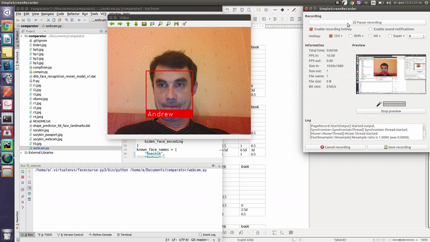

# Разпознавание человека по видео

```bash
    python3 webcam3.py
```
### Заполнить базу, распознать по фото (закомментировать ненужное):
```bash    
        python3 fr3.py <file>.jpg
```
## Installation on Ubuntu 17.10:
```bash
    sudo apt-get install python3-tk -y
    sudo apt install python3-opencv -y
    pip3 install -r requrements.txt
```    



